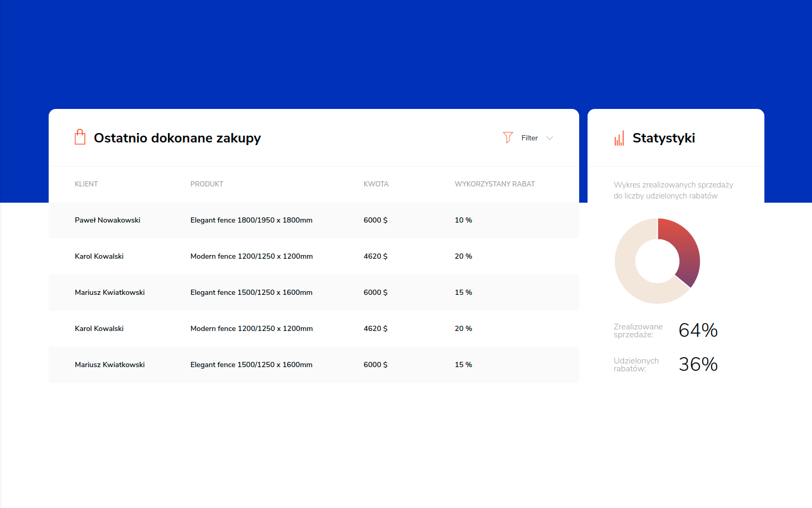

# Homeden Layout

> Simple PSD to Vue

## Live preview

Live preview is available here: https://karol-waliszewski.github.io/Homeden-layout/

## Development server

Run `npm serve` or `yarn serve` for a dev server. Navigate to `http://localhost:8080/`. The app will automatically reload if you change any of the source files.

## Build

Run `npm build` or `yarn build` to build the project. The build artifacts will be stored in the `dist/` directory.

### Technologies 🔧 
+ [Vue](https://vuejs.org/)

#### Meta
Karol Waliszewski - [github](https://github.com/Karol-Waliszewski) - [karolwaliszewski@gmail.com](mailto:karolwaliszewski@gmail.com)

https://karol-waliszewski.github.io/Homeden-layout/
